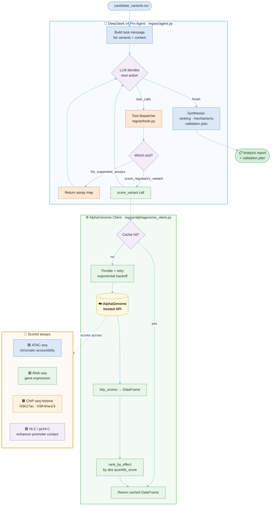
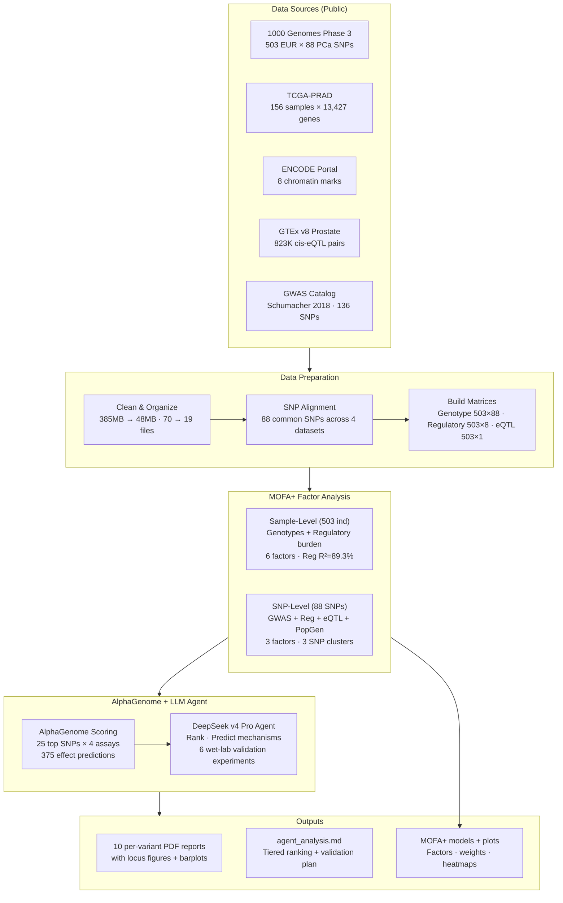

# regvar-agent

**Regulatory variant triage using AlphaGenome + a DeepSeek LLM agent**

Scores candidate non-coding variants with [AlphaGenome](https://deepmind.google.com/science/alphagenome) across ATAC-seq, RNA-seq, ChIP-seq histone marks, and Hi-C / pcHi-C, then uses a [DeepSeek v4 Pro](https://api.deepseek.com) reasoning agent to synthesise the predictions into a prioritised, wet-lab-ready validation plan.

The biological framing is prostate cancer: non-coding variants in stromal-fibroblast regulatory elements near risk loci, interpreted across the multi-omic assays a wet lab measures.

---

## Architecture



---

## Project layout

```
regvar/
  __init__.py             package exports
  __main__.py             python -m regvar entry point → delegates to cli.py
  cli.py                  click CLI: score / plot / agent / mofa / report / assays / tui
  plot.py                 matplotlib barplot helper + REF/ALT locus figure (dark theme)
  tui.py                  Textual TUI: interactive tabs for all commands
  alphagenome_client.py   hardened AlphaGenome wrapper (cache · retry · throttle)
  variants.py             TSV parsing, coordinate conventions, effect ranking
  tools.py                validated tool boundary + OpenAI & Anthropic schemas
  agent.py                DeepSeek tool-use agent loop → analysis + validation plan
  report.py               one-page variant report generator (LaTeX PDF via Jinja2)
  mofa_view.py            MOFA+ view builder — variant scores → sample-level matrices
  mofa_integration.py     optional MOFA+ runner (lazy-imports mofapy2)
  templates/
    report.tex.j2         Jinja2 LaTeX template for variant PDF reports
mcp_server.py             same tools exposed over MCP (Claude Code / IDE agents)
pyproject.toml            package metadata + `regvar` console entry point
examples/
  candidate_variants.tsv  illustrative hg38 candidates (replace with your own)
  example_genotypes.tsv   sample genotype table for MOFA+ integration
tests/
  test_variants.py        unit tests for coordinate logic and ranking
  test_tui.py             headless Textual Pilot smoke tests for the TUI
  test_mofa.py            unit tests for genotype bridge and MOFA+ view building
requirements.txt
```

---

## Quickstart

### 1. Install as a CLI tool

```bash
pip install -e .
```

This adds the `regvar` command to your PATH. All commands work without
installation too via `python -m regvar`.

### 2. Set API keys

```bash
export ALPHAGENOME_API_KEY=...   # free, non-commercial: deepmind.google.com/science/alphagenome
export DEEPSEEK_API_KEY=...      # deepseek.com
```

Or create a `.env` file at the repo root (gitignored; see `.env.example`).

### 3. Run the unit tests (no keys, no network)

```bash
pytest -q
```

---

## CLI reference

`regvar` is structured as four command groups plus flat utility commands.

```
regvar
├── score                    score a single variant (no agent)
├── plot
│   └── effects              barplot of top predicted effects
├── agent
│   ├── run                  full triage loop over a TSV
│   └── chat                 interactive REPL with the agent
├── mofa
│   ├── build                build MOFA+-ready view matrices
│   ├── run                  train a MOFA+ model
│   └── compare              compare models with vs. without variant views
├── report
│   └── generate             generate one-page PDF report per candidate variant
├── assays                   list supported assays
├── tui                      launch the Textual TUI
└── run                      ← alias for `agent run` (backward compat)
```

### `regvar score` — score a single variant

```bash
regvar score chr8 127401060 G T
regvar score chr8 127401060 G T --assays ATAC-seq,RNA-seq --top-n 20
regvar score chr8 127401060 G T --output-tsv scores.tsv
regvar score chr8 127401060 G T --output-png effects.png
regvar score chr8 127401060 G T --json
```

| Flag | Default | Description |
|------|---------|-------------|
| `-a` / `--assays` | ATAC-seq, RNA-seq, ChIP-seq histone, Hi-C / pcHi-C | Comma-separated assay list |
| `-t` / `--tissue` | `UBERON:0002367` (prostate gland) | Comma-separated UBERON/CL ontology terms |
| `-n` / `--top-n` | `10` | Top effects to show |
| `--output-tsv` | — | Save results as TSV |
| `--output-png` | — | Save a barplot as PNG |
| `--json` | off | Print raw JSON |

### `regvar plot effects` — barplot of variant effects

```bash
regvar plot effects chr8 127401060 G T --output effects.png
regvar plot effects chr8 127401060 G T --show
regvar plot effects chr8 127401060 G T \
    --from-tsv scores.tsv --assay-filter ATAC-seq --output atac.png
```

| Flag | Default | Description |
|------|---------|-------------|
| `-n` / `--top-n` | `20` | Tracks to plot |
| `--from-tsv` | — | Load a pre-computed TSV instead of calling the API |
| `--assay-filter` | — | Keep only rows matching this assay label |
| `-o` / `--output` | — | Save plot (`.png` / `.svg` / `.pdf`) |
| `--show` | off | Open an interactive matplotlib window |

### `regvar agent run` — full triage loop

```bash
regvar agent run examples/candidate_variants.tsv
regvar agent run examples/candidate_variants.tsv --dry-run
regvar agent run examples/candidate_variants.tsv \
    -o report.md --output-tsv scores.tsv
```

The agent will:
1. Score each variant with AlphaGenome
2. Rank by predicted functional impact
3. Explain the likely regulatory mechanism per top candidate
4. Propose a prioritised wet-lab validation plan

| Flag | Default | Description |
|------|---------|-------------|
| `-a` / `--assays` | ATAC-seq, RNA-seq, ChIP-seq histone, Hi-C / pcHi-C | Comma-separated assay list |
| `-t` / `--tissue` | `UBERON:0002367` | Comma-separated UBERON/CL ontology terms |
| `-n` / `--top-n` | `10` | Effects per variant |
| `-m` / `--model` | `deepseek-v4-pro` | LLM model |
| `-o` / `--output` | — | Save markdown report to file |
| `--output-tsv` | — | Save ranked scores as TSV |
| `--dry-run` | off | Validate input, no API calls |
| `-v` / `--verbose` | off | Show full tool-call arguments |
| `-q` / `--quiet` | off | Only print the final report |

### `regvar agent chat` — interactive REPL

Start a live conversation with the agent. Ask about variants in plain English;
the agent calls AlphaGenome tools on demand.

```bash
regvar agent chat
regvar agent chat --tissue UBERON:0002367 --top-n 15
```

Type `exit` or press `Ctrl-C` to quit.

### `regvar assays` — list supported assays

```bash
regvar assays
```

### `regvar tui` — interactive TUI

The easiest way to explore results without remembering flags:

```bash
regvar tui
```

Three tabs are available:

| Tab | Shortcut | What it does |
|-----|----------|--------------|
| **▶ Run Agent** | `1` | Fill in your TSV path + options, then run the full DeepSeek agent loop with live progress and a rendered markdown report |
| **⬡ Score Variant** | `2` | Enter chr / pos / ref / alt and view the top predicted effects in a scrollable table |
| **☰ Assays** | `3` | Browse all supported assays and their wet-lab readouts |

Press `F1` for a keyboard-shortcut summary. Press `Ctrl+Q` to quit.

---

## (Optional) Expose tools over MCP

```bash
pip install "mcp[cli]"
python mcp_server.py
```

Point any MCP-compatible client (Claude Code, Cursor, etc.) at the server to use the same scoring tools interactively.

---

## MOFA+ Multi-Omic Integration

Connect AlphaGenome's per-assay variant scores to [MOFA+](https://github.com/bioFAM/MOFA2)
(Multi-Omics Factor Analysis) for joint factor decomposition alongside real
multi-omic data.

### Concept

AlphaGenome scores are **genotype-agnostic** — they predict the functional
effect of the alt allele *if present*. MOFA+ operates on **sample-level
matrices** — `(N_samples, D_features)` per assay. The bridge uses an **additive
dosage model**: for each sample, the variant-effect score is multiplied by the
number of alt allele copies (0/1/2), producing a per-sample, per-feature value
MOFA+ can decompose.

Each AlphaGenome assay becomes a separate MOFA+ "view":

| MOFA+ View | Assay | Features per variant |
|------------|-------|---------------------|
| `ATAC-seq` | ATAC-seq | 1 per variant × output track |
| `RNA-seq` | RNA-seq | 1 per variant × gene |
| `ChIP-seq_histone` | ChIP-seq histone | 1 per variant × mark |
| `Hi-C_pcHi-C` | Hi-C / pcHi-C | 1 per variant × contact |

### `regvar mofa build` — build view matrices

```bash
# From a saved scores TSV + genotype table
regvar mofa build scores.tsv genotypes.tsv -o views.h5ad

# Subset of assays, custom aggregation
regvar mofa build scores.tsv genotypes.tsv --by top_gene --assays ATAC-seq,RNA-seq

# Export individual CSVs
regvar mofa build scores.tsv genotypes.tsv --output-csv-dir views/
```

| Flag | Default | Description |
|------|---------|-------------|
| `-a` / `--assays` | All in scores | Comma-separated assay subset |
| `--by` | `max_abs` | Aggregation: `max_abs`, `top_gene`, `all` |
| `-o` / `--output` | — | Save as AnnData `.h5ad` |
| `--output-csv-dir` | — | Save views as individual TSV files |

### `regvar mofa run` — train MOFA+

```bash
# Train a factor model on the pre-built views
regvar mofa run views.h5ad --factors 10 -o model.hdf5
regvar mofa run views.h5ad --factors 15 --convergence medium
```

Requires: `pip install mofapy2 anndata` (or `pip install -e ".[mofa]"`).

### `regvar mofa compare` — quantify variant contribution

```bash
# Train with vs. without variant views; report variance explained
regvar mofa compare views.h5ad -o comparison.md
```

This is the key analysis: it trains two MOFA+ models (with and without the
variant-effect views) and reports how much additional variance the regulatory
variants explain in each factor and view.

### Genotype table format

`examples/example_genotypes.tsv` — tab-separated, one column per variant:

```
sample_id   chr8:127401060:G>T   chr10:46046326:A>G   ...
SAMPLE_01   0                    1
SAMPLE_02   1                    2
SAMPLE_03   NaN                  0
```

Values are alt allele dosage: `0` (homozygous ref), `1` (heterozygous),
`2` (homozygous alt), or blank/`NaN` for missing genotypes (MOFA+ natively
imputes these).

### Python API

```python
from regvar import build_mofa_view, read_genotypes_tsv, scored_variants_from_tsv

# Load scores and genotypes
scored = scored_variants_from_tsv("scores.tsv")
genotypes = read_genotypes_tsv("genotypes.tsv")

# Build MOFA+-ready view matrices
views = build_mofa_view(scored, genotypes, by="max_abs")
# → {"ATAC-seq": DataFrame, "RNA-seq": DataFrame, ...}

# Train (requires mofapy2)
from regvar.mofa_integration import train_mofa, compare_variant_contribution
model = train_mofa(views, n_factors=10)
```

### Aggregation strategies

When a variant produces multiple score rows for a single assay (e.g., affects
3 genes via RNA-seq), the `--by` flag controls how they collapse:

| Strategy | Behaviour |
|----------|-----------|
| `max_abs` (default) | Pick the row with highest `|quantile_score|`. Label: `combined`. |
| `top_gene` | Same as max_abs, but feature name uses the actual top-scoring gene. |
| `all` | Expand every track into a separate feature column. |

---

## Variant Report Generator

Generate a polished, one-page PDF per candidate variant — auto-assembling figures,
scores, and interpretation — for sharing with collaborators, clinicians, and
non-technical stakeholders.

Each report contains:
- **REF/ALT locus context figure** — sequence-level view of the variant with flanking bases and nearby genes
- **Regulatory effect barplot** — top assay scores colour-coded by data type
- **Scoring summary table** — assay, gene, biosample, raw and quantile scores
- **Mechanistic interpretation** — extracted from the agent's analysis or synthesised from scores
- **Validation recommendation** — suggested wet-lab experiment (if present in the agent report)

The generator reads saved output from `regvar agent run` and works entirely
offline — no API calls. Reports are compiled via `pdflatex` from a Jinja2
LaTeX template.

### `regvar report generate` — generate per-candidate PDFs

```bash
# Generate reports for the top 5 variants (by max |effect|)
regvar report generate scores.tsv analysis.md --top-n 5 --tissue "Prostate"

# Generate reports for ALL candidates
regvar report generate scores.tsv analysis.md --all --no-compile

# Custom output directory
regvar report generate scores.tsv analysis.md --output-dir ./patient_reports --verbose
```

| Flag | Default | Description |
|------|---------|-------------|
| `-c` / `--candidates` | `examples/candidate_variants.tsv` | Original candidate TSV for metadata |
| `-o` / `--output-dir` | `./reports/` | Output directory for per-candidate PDFs |
| `-n` / `--top-n` | `5` | Generate reports for top N variants |
| `--all` | off | Generate for ALL variants (overrides `--top-n`) |
| `--template` | `default` | LaTeX template name (from `regvar/templates/`) |
| `--tissue` | — | Tissue/cell-type context for report header |
| `--prefix` | `variant_report` | Output filename prefix |
| `--no-compile` | off | Write `.tex` files only, skip `pdflatex` |
| `--clean` | off | Remove `.aux`, `.log` after compilation |
| `-v` / `--verbose` | off | Print `pdflatex` output to stderr |

Output files are named:
```
{prefix}_{chr}_{position}_{rsid}.pdf
# e.g.: variant_report_8_127401060_rs6983267.pdf
```

### Requirements

```bash
pip install -e ".[report]"    # installs jinja2>=3.0
```

A LaTeX distribution (`pdflatex`) must be installed on your system. On Ubuntu/Debian:

```bash
sudo apt install texlive-latex-base texlive-latex-recommended
```

If `pdflatex` is not available, use `--no-compile` to generate `.tex` files that
can be compiled elsewhere.

### Python API

```python
from regvar.report import ReportBuilder, parse_scores

# Parse scores and build report objects
builder = ReportBuilder(tissue="Prostate")
reports = builder.build(
    candidates_tsv="examples/candidate_variants.tsv",
    scores_tsv="scores.tsv",
    report_md="analysis.md",
)

# Generate LaTeX source for a single variant
tex = builder.render(reports[0])
print(tex[:200])

# Generate PDFs for top 5 variants
pdfs = builder.generate_all(reports, output_dir="./reports", top_n=5)
for p in pdfs:
    print(f"✓ {p}")
```

### Report layout

```
┌──────────────────────────────────────────┐
│ HEADER      Regulatory Variant Report    │
│ ═══════════════════════════════════════  │
├──────────────────────────────────────────┤
│ VARIANT     chr8:127,401,060 G→T  [TIER] │
│ ID BAR      rs6983267 · 8q24.21 · MYC   │
├──────────────────┬───────────────────────┤
│ REF/ALT LOCUS    │ TOP REGULATORY        │
│ CONTEXT          │ EFFECTS               │
│ (sequence tiles, │ (barplot, top 5-6     │
│  variant         │  assay/gene/biosample │
│  highlighted,    │  by |effect|)         │
│  nearby genes)   │                       │
├──────────────────┴───────────────────────┤
│ SCORING SUMMARY TABLE                    │
│ Assay | Gene | Biosample | Raw | Quantile│
├──────────────────────────────────────────┤
│ INTERPRETATION                           │
│ Mechanism · Validation recommendation    │
├──────────────────────────────────────────┤
│ FOOTER    7 assays · Prostate  · Page 1/1│
└──────────────────────────────────────────┘
```

---

## Python API

Use the client directly without the agent or CLI:

```python
from regvar import AlphaGenomeClient

client = AlphaGenomeClient()
df = client.score_variant(
    "chr8", 127401060, "G", "T",
    assays=["ATAC-seq", "RNA-seq", "Hi-C / pcHi-C"],
)
print(df.sort_values("quantile_score", key=abs, ascending=False).head())
```

Render a barplot from Python:

```python
from regvar.plot import plot_effects
from regvar.tools import tool_score_regulatory_variant

result = tool_score_regulatory_variant("chr8", 127401060, "G", "T", top_n=20)
plot_effects(result["top_effects"], title="chr8:127401060 G>T",
             output_path="effects.png")
```

---

## Supported assays

| Label | AlphaGenome output | Wet-lab readout |
|---|---|---|
| `ATAC-seq` | `ATAC` | Chromatin accessibility |
| `DNase-seq` | `DNASE` | Chromatin accessibility (alt) |
| `RNA-seq` | `RNA_SEQ` | Gene expression |
| `ChIP-seq histone` | `CHIP_HISTONE` | H3K4me3/me1, H3K27ac, H3K27me3 |
| `ChIP-seq TF` | `CHIP_TF` | Transcription-factor binding |
| `Hi-C / pcHi-C` | `CONTACT_MAPS` | Enhancer–promoter looping |
| `splicing` | `SPLICE_SITES` | Splice-site usage |

---

## Input format

`examples/candidate_variants.tsv` — tab-separated, 1-based VCF coordinates:

```
chromosome  position    ref  alt  region_id     note
chr8        127401060   G    T    8q24_enh_1    8q24.21 enhancer near MYC
chr8        127298000   A    C    8q24_enh_2    stromal-fibroblast ATAC peak
chr10       8005000     C    T    GATA3_enh     enhancer near fibroblast TF
chr17       48800000    G    A    HOXB13_prom   promoter-proximal, prostate TF
chr2        241500000   T    G    ctrl_region   intergenic negative control
```

Replace with your own GWAS / fine-mapping candidates.

---

## Design decisions

**Why a validated tool boundary?**
Letting an LLM free-form generate API calls in a loop risks silently mishandling coordinates (0- vs 1-based, REF/ALT strand) or stampeding a shared rate-limited service. The tool layer owns coordinate correctness, caching, and throttling. The agent reasons about biology; the code guarantees calls are correct and cheap.

**Why on-disk caching?**
AlphaGenome's public API is rate-limited and shared. Caching every request means re-running a partially-completed batch or re-analysing the same variants costs nothing and is reproducible.

**Why DeepSeek v4 Pro?**
It supports extended thinking (`reasoning_effort="high"`) via the OpenAI-compatible API, making it well suited to multi-step genomic reasoning and structured tool-use loops.

---

## Caveats

- AlphaGenome predictions are **modelling hypotheses for experimental testing**, not clinical conclusions.
- The public API suits thousands of predictions; for >1M-scale screens, revisit local inference.
- Example coordinates are **illustrative hg38 placeholders** — swap in real candidates from your cohort.
- Quantile scores compress at the high end; always weight predictions against biological context (gene identity, tissue relevance, known GWAS associations).

---

## Multi-Omics Integration Pipeline (MOFA+)

The full pipeline integrates 4 public data layers with AlphaGenome scoring and MOFA+ factor analysis to prioritise prostate cancer risk variants.



### Pipeline Steps

| Step | Command | Output |
|------|---------|--------|
| **1. Data prep** | Clean & organize `mofa_data/` | 19 files, 7 directories |
| **2. MOFA sample** | `run_mofa_experiment.py` | 6 factors, Reg R²=89.3% |
| **3. MOFA SNP** | Same script | 3 SNP clusters (MSMB, HOXB13, 8q24) |
| **4. Agent run** | `regvar agent run top25_candidates.tsv -o analysis.md` | 17KB ranked analysis |
| **5. Build views** | `regvar mofa build scores.tsv genotypes.tsv` | 4 assay views (503×33) |
| **6. Reports** | `regvar report generate scores.tsv analysis.md` | 10 PDFs in `mofa_results/reports/` |

### Key Findings

| Rank | rsID | OR | Gene | Mechanism |
|:---:|:---|:---:|:---|:---|
| 1 | rs138213197 | **3.85** | HOXB13 | Pioneer TF disruption — prostate lineage |
| 2 | rs10993994 | 1.23 | MSMB | Promoter ARE — canonical PCa variant, 888 eQTLs |
| 3 | rs183373024 | **2.91** | MYC/PCAT1 | Prostate-specific ChIP-seq at 8q24 enhancer |
| 4 | rs28441558 | 1.16 | SLC35G6 | Effect in **prostate gland** tissue |
| 5 | rs1004030 | 1.05 | MMP14 | TF binding → matrix remodelling in stroma |

**MOFA sample-level**: Factor 1 captures genetic→regulatory axis (ρ=0.933).  
**MOFA SNP-level**: 3 latent factors separate high-effect variants (F1), MSMB/HLA region (F2), and chr16 co-localized SNPs (F3).

Full results: [`mofa_data/mofa_results/`](mofa_data/mofa_results/)

---

## License

Apache 2.0
