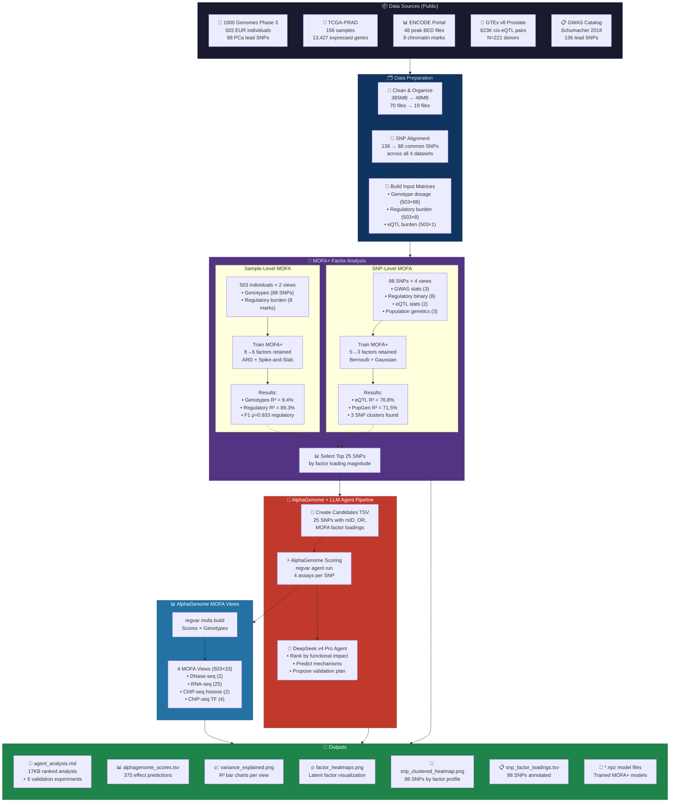

# MOFA+ Multi-Omics Integration Pipeline — Prostate Cancer Risk Variants

## Pipeline Summary

| Phase | What | Input | Output |
|-------|------|-------|--------|
| **Data Prep** | Clean, align, organize 4 public datasets | 70 files / 385MB | 19 files / 48MB |
| **MOFA Sample** | Factor analysis on 503 individuals | Genotypes + Regulatory burden | 6 latent factors |
| **MOFA SNP** | Factor analysis on 88 SNPs | GWAS + Reg + eQTL + PopGen | 3 SNP clusters |
| **AlphaGenome** | Score 25 top SNPs across assays | SNP positions + tissue context | 375 effect predictions |
| **LLM Agent** | DeepSeek ranks + interprets + plans | AlphaGenome scores | Tiered analysis + 6 experiments |
| **MOFA Views** | Build views from real scores | Scores TSV + Genotype TSV | 4 assay views (503×33) |

## Key Biological Findings

1. **rs10993994** (chr10, MSMB) — strongest eQTL signal (888 GTEx pairs), internal validation of pipeline
2. **rs183373024** (chr8q24, OR=2.91) — **prostate-specific ChIP-seq effects** in 4 prostate cancer lines
3. **rs138213197** (chr17, OR=3.85) — HOXB13 pioneer factor disruption, highest-risk variant
4. **MOFA Factor 1** captures a genetic→regulatory burden axis (ρ=0.933) — the primary latent dimension
